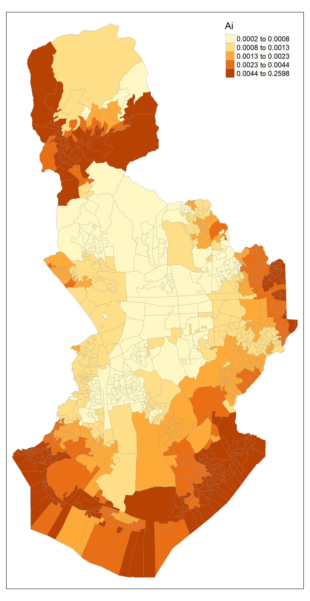

# Generalized 2SFCA

This code for the generalized two-step floating catchment area (G2SFCA) method was used in Kim, K., & Kwon, K. (2022). Time-varying spatial accessibility of primary healthcare services based on spatiotemporal variations in demand, supply, and traffic conditions: A case study of Seoul, South Korea. *Journal of Transport & Health*, *27*, 101531. [[Link](https://www.sciencedirect.com/science/article/pii/S2214140522002031)]

접근성 지표는 다음의 수식으로 계산된다. 

$A_i = \sum_j \frac{S_j f(d_{ij})} { \sum_k P_k f(d_{kj})}$

여기서 $P_k$ 는 $k$에서의 수요이고, $S_j$는 $j$ 시설의 공급을 의미하며, $d_{kj}$는 수요 지점 $k$에서 공급 지점 $j$까지의 이동시간이다. 

$f(d_{ij})$는 거리/시간 조락 함수이며, power, negative exponential 또는 Gaussian 함수가 이용된다. Kim and Kwon (2022) 연구에서는 Gaussian 함수를 이용했으며, catchment area를 15분으로 설정했기 때문에 15분 한계거리에서 $f(d_{ij})$를 0.01로 만드는 Gaussian의 $\beta 파라미터로 50을 이용했다. 

Gaussian 함수 수식: $f(d_{ij}) = exp^{-d_{ij}^2/\beta}$

G2SFCA를 계산하기 위한 Generalized2SFCA 함수는 몇 가지 파라미터들을 필요로 한다. 

* `network_data`: 이미 계산된 OD cost matrix (data.frame object)

* `cost_col`: `network_data`에 포함된 distance 또는 time 열의 이름 (string)

* `demand_data`: 수요 자료의 이름 (data.frame object)

* `demand_id`: 수요 자료에서 id의 열 이름 (string)

* `demand_col`: 수요 자료에서 수요를 의미하는 열 이름 (string)

* `supply_data`: 공급 자료의 이름 (data.frame object)

* `supply_id`: 공급 자료에서 id의 열 이름 (string)

* `supply_col`: 공급자료에서 공급을 의미하는 열 이름 (string)

* `catchment`: 한계 거리 또는 시간 설정 (numeric)

* `impedance_beta`: Gaussian 함수의 $\beta$ 파라미터 (numeric)

기본적인 데이터 구성은 다음과 같다.

**network_data**

| demand_id     | supply_id     | cost_col      |
| ------------- | ------------- | ------------- |
| 101100        | hkh5592       | 5             |
| 101100        | kkn4421       | 13            |
| . . . | . . . | . . . |

**demand_data**

| demand_id     | demand_col    |
| ------------- | ------------- |
| 101100        | 5042          |
| 101101        | 7220          |
| . . . | . . . |

**supply_data**

| supply_id     | supply_col    |
| ------------- | ------------- |
| hkh5592       | 2             |
| kkn4421       | 5             |
| . . . | . . . |

샘플 데이터에서 알 수 있듯이, `network_data`는 demand 데이터의 `id`와 supply 데이터의 `id`를 공유해야 한다. 

G2SFCA의 결과는 다음의 그림과 같다. 

# Road network travel time 계산

Traffic congestion을 고려한 road network travel time을 계산하기 위해 R에서 국가교통DB와 [서울시교통정보](https://topis.seoul.go.kr/)의 차량통행속도를 매칭시켜 도로망 자료를 구축. 

서울특별시 교통소통 [표준링크 매핑정보](http://data.seoul.go.kr/dataList/OA-15061/S/1/datasetView.do)를 이용해 연계. 

각 시간별 traffic congestion을 계산하는 코드는 `sciprts/GetRoadNetwork.R` 에서 수행할 수 있으며, **차량통행속도**, **표준링크 매핑정보**, **도로망 shapefile**, **시도 shapefile**이 필요함. 

해당 코드로부터 **road_network_ktdb**를 만든 후, Python을 이용해 road network travel time을 계산. 

Road network travel time은 `scripts/Arcpy_NetworkAnalysis.py`를 이용해 계산함. 이 코드는 ArcGIS Pro의 ArcPy를 이용하기 때문에, ArcGIS Pro가 설치되어 있어야 하며, PyCharm 또는 VisualStudioCode에서 Python Interpreter가 Python 3.7 (arcgispro-py3) 버전으로 설정되어야 함.

실행 방식은 ArcGIS에서 network geodatabase를 먼저 만들어 준 뒤, `GetRoadNetwork.R`에서 만든 `road_network_ktdb`를 network dataset으로 변환해야 함. 이때 network geodatabase 안에 출발지와 도착지 정보 모두 포함되어야 함. 

# Miscellaneous

* **SplitOrigins.py**: 집계구를 10개로 나누는 파이썬 코드. Network analysis를 위해 집계구를 10개로 나누어야 함. 
